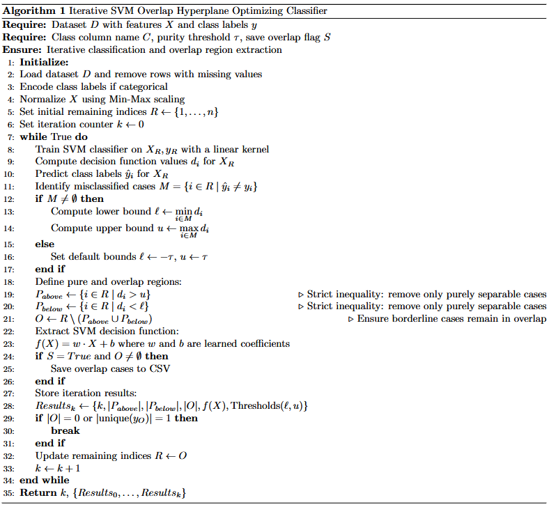
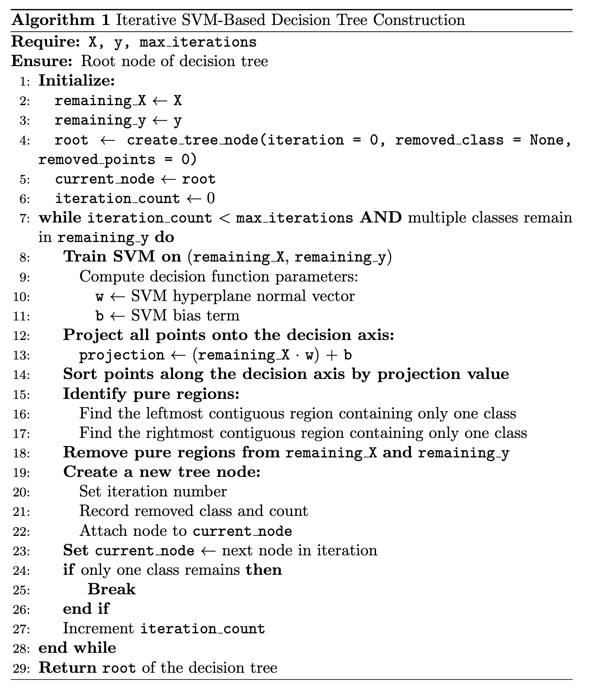

# Iterative SVM Classifier

Novel classifier with SVM iteratively refining class borders from our recent paper, now expanding studies.

Achieved 100% accuracy on WBC 9 and 30 attribute datasets in our upcoming paper "Boosting of Classification Models with Human-in-the-Loop Computational Visual Knowledge Discovery."

Origianl algorithm pseudocode:

Two-class algorithm pseudocode:

## Results

| Dataset Name | Tree Depth | Number of Decision Nodes |
|--------------|------------|--------------------------|
| Iris (No Setosa) | 4 | 3 |

## License

This project is freely available for both personal and commercial use under the [MIT License](LICENSE).
